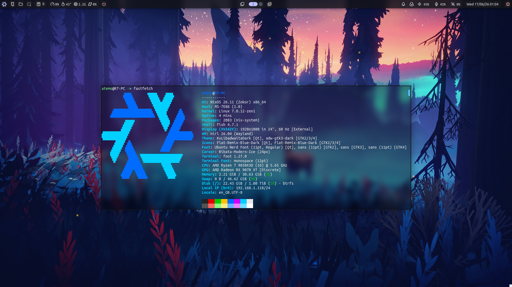

Wallpaper by Mikael Gustafsson.

---

## Broken package: 1 (see below)
### RPCS3
- Status: **Disabled** in [**`./programs/gaming.nix`**](./programs/gaming.nix#L20)
- Waiting on:
	- [x] Issue creation [https://github.com/NixOS/nixpkgs/issues/529700]
	- [x] Pull request creation [https://github.com/NixOS/nixpkgs/pull/530692]
	- [ ] Pull request merge
	- [ ] Integration into `nixos-unstable-small`

## Changelog (16-17/06/2026):
Complete clean-up of the NixOS configuration. It was about time. There are too many changes to list all there, so here are a few:
- GDM is now the Display Manager for logging into Niri
- Home Manager has been removed, only NixOS options are now used
- Flatpak has been removed, only native packages are now used (I can smell the pain arriving)
- Both of the above mean that this is now a 100% "pure" NixOS configuration!
- All "useless" extra custom modules have been removed
- Proprietary NVIDIA GPU driver support is no longer **officially** there, as I no longer have an NVIDIA GPU. The previous tweaks to make things work better with them are still here; However, they are fully untested and may be completely broken.
- Setup-specific modules are now handled/imported in each computer's `settings.nix` module, instead of polluting the main `configuration.nix` import list
- FISH abbreviations have been overhauled to use full package paths, so that they may not just disappear when certain packages are not included in `environment.systemPackages = [];`
- Some programs have been replaced, such as `lximage-qt` having been replaced with `pix`, or `xreader` having been replaced with GNOME's `papers`
- Theming is now more consistent, as everything basically has a Libadwaita look but with nice Bibata cursors, Ubuntu fonts, and Flat Remix icons; Be it for GTK or QT programs
- The `lofi` list of abbreviation have been updated, more chill and nixing :3
- The system has slightly more branding and visual niceties in a few random places
- `nix-output-monitor` is now used to make a lot of Nix command outputs look a lot better
- Samba file sharing now works straight out-of-the-box in Thunar
- And more…

---

<h1 align="center">Atemo's NixOS configuration</h1>
<p align="center"></p>
<h4 align="center">An opinionated NixOS configuration that does not piss me off</h4>

---

# General information
## Origin
This NixOS configuration is the configuration I use on my main system, with the only thing changing with my other systems being which computer is uncommented in [**`configuration.nix`**](./configuration.nix)'s imports. It is a successor to my old NixOS configuration, which has long been archived.
https://github.com/Atemo-C/OLD-NixOS-Configuration

## Main components
It is a single-user setup, using Niri as the Wayland compositor, Noctalia as the desktop shell, and NixOS Unstable at its very core (NixOS stable is NOT supported by this configuration). \
• https://github.com/YaLTeR/niri \
• https://github.com/noctalia-dev/noctalia-shell

## External dependencies
It does not rely on nor use Home Manager, Nix Flakes, Flatpaks, or any of the likes. However, you may find that installing Flatpaks could give a better experience with some programs that are often broken in nixpkgs. This configuration will keep up with broken packages, and actively list them at the very top of the configuration.

## Usage disclaimer
Finally, since this entire desktop experience is crafted by and for myself, it will likely not fit most other people's needs and desires. You may feel free to take inspiration from this configuration to help improve your own NixOS configuration. You *could* use this configuration fully, but I may offer no support for it. Though, if you have suggestions for improvements, I am open to them.

With this out of the way, we can now proceed to the installation instructions. \
These are the steps I take when I install NixOS on my devices; It may not work for you, nor be what you want. Again, feel free to take inspiration from it, and adapt them to your liking and needs.

# Installation and usage
I have a pretty consistent way of setting up my computers when I install NixOS. Below are the steps I take to install NixOS on my devices, though this can easily be converted in a small shell script if you want. I have integrated one in my own NixOS ISOs; However, it is not complete, hence it is not yet here.

## Assumptions
It is assumed, for these installations instructions, that you:
- Are familiar with Linux;
- Are familiar with NixOS, or have at least used it once;
- Are comfortable in the command-line;
- Are currently using Linux (be it on hardware or on a virtual machine);
- Have a stable power source and networking;
- Have configured your device's BIOS or EFI firmware to boot and install NixOS properly.

## Pre-installation

### Downloading NixOS
Since this configuration is based on NixOS unstable, it is highly recommended to download the latest NixOS unstable ISO image. Graphical or not, it matters not, but if you need or want to use a graphical environment during the installation, go with graphical.
- [ Graphical ISO ](https://channels.nixos.org/nixos-unstable/latest-nixos-graphical-x86_64-linux.iso)
- [ Minimal ISO ](https://channels.nixos.org/nixos-unstable/latest-nixos-minimal-x86_64-linux.iso)

### Creating a bootable NixOS medium
The NixOS ISO is too big to fit on a CD or smaller. As such, a DVD or any removable and bootable storage medium with above 4 GB of storage space is necessary. I will be using a USB flash drive here, and it is assumed that the current environment is already Linux-based. \
To stay as dependency-free as possible, I will here use `dd` to flash the downloaded ISO file to the flash drive, but you may use any other utility. Graphically, I quite like Fedora's Media Writer, or Linux Mint's mintstick utility. \
First, we must see which drive is to be used for the installation. A simple `lsblk` command will show us what we need:
```
NAME                    MAJ:MIN RM   SIZE RO TYPE  MOUNTPOINTS
sda                       8:0    0 931,5G  0 disk
└─sda1                    8:1    0 931,5G  0 part
  └─Toshiba-1TB-HDD     254:3    0 931,5G  0 crypt /run/media/atemo/Toshiba-1TB-HDD
sdb                       8:112  1  28,7G  0 disk
└─sdb1                    8:113  1  28,7G  0 part
zram0                   253:0    0  31,3G  0 disk  [SWAP]
nvme0n1                 259:0    0 931,5G  0 disk
├─nvme0n1p1             259:1    0     1G  0 part  /boot
├─nvme0n1p2             259:2    0    10G  0 part
│ └─swap                254:0    0    10G  0 crypt [SWAP]
└─nvme0n1p3             259:3    0 920,5G  0 part
  └─root                254:1    0 920,5G  0 crypt /home
                                                   /nix/store
                                                   /nix
                                                   /
```
Here, `sdb` is my ~30 GB USB flash drive. As you can see, it already has a partition. This is a good reminder that the following process will erase ALL data on this USB flash drive; So, it is better to be careful and make absolutely sure we are selecting the right one. \
We can now write the ISO file to the flash drive, with the following command as a privileged user: \
`dd bs=4M if=latext-nixos-graphical-x86_64-linux.iso of=/dev/sdb conv=fsync oflag=direct status=progress`
Notes:
- Replace `latest-nixos-graphical-x86_64-linux.iso` with the appropriate filename;
- Replace `/dev/sdb` with the appropriate device to write the ISO file to.

Once this is done, the installation medium is now ready to be used. \
However, in my case, there is an extra thing I like to do. As I have used a large USB flash drive, there is now an empty partition of about 20 GB left on it. If you want (and this is what I sometimes do), you can manually format it to store some data on it, such as wallpapers, documentation, totally not questionable content, or whatever floats your elephant. This is just a bonus step, and not necessary in the slightest.

## Installation
Note that all the following command-line steps assume a privileged environment (`sudo -i`).

### Booting into NixOS
Insert the installation medium into the target computer, and start it. If your computer does not automatically boot to the installation medium, or do not know which key to press to open the boot menu, refer to your BIOS' settings and your motherboard manufacturer's documentation. \
Once you have booted, make sure to configure your keyboard layout and networking if necessary. The default NixOS ISO lets you configure the key map in the TTY with the `loadkeys` command as a privileged user, and you can connect to a network using `nmtui`. Graphical environments come with their own utilities for this.

### Partitioning
In my installation, I typically use an encrypted, single-drive setup, on an EFI system. You can easily adapt the following steps for a multi-drive setup and a BIOS-only system, though I will not document BIOS installations here until I can install NixOS on a BIOS-only system that is not as slow as my ThinkPad L510… \
As before, command-line utilities will be used for maximum compatibility and minimum dependencies, but a lot of these steps can be done using graphical tools.

1. Enter a shell as root with `sudo -i`.
2. List the current storage devices with `lsblk`, and identify the one you want to use. \
In the case of this example, I will select `/dev/sda`, which is an empty 1 TB hard disk drive. Obviously, any data on it will be lost in the next few steps.
```
NAME                    MAJ:MIN RM   SIZE RO TYPE  MOUNTPOINTS
sda                       8:0    0 931,6G  0 disk
sdb                       8:112  1  28,7G  0 disk
└─sdb1                    8:113  1  28,7G  0 part
```
3. Open the desired storage device with fdisk.
```shell
fdisk /dev/sda
```
You should see an output similar to this:
```
Welcome to fdisk (util-linux <version>).
Changes will remain in memory only, until you decide to write them.
Be careful before using the write command.

Command (m for help):
```
#### Boot partition
4. Create a GPT partition table by typing `g` then pressing `Enter`.
5. Create a boot partition by typing `n`.
6. When asked about the partition number, type `1` then press `Enter`.
7. When asked about the **first** sector, it should be left unchanged, simply press `Enter`.
8. When asked about the **last** sector, type `+1G` then press `Enter`.
Note that you can change this size to be smaller or bigger, depending on the number of Linux Kernels you plan on keeping, especially if you keep lots of NixOS generations around. \
If the drive was not empty at first, fdisk will warn you before continuing. Type `y` then press `Enter`.
9. Set the type of the boot partition by typing `t` then press `Enter`.
10. When asked about the partition type, type `1` then press `Enter`.

#### Swap partition
11. Create a swap partition by typing `n`.
12. When asked about the partition number, it should be `2`.
13. When asked about the **first** sector, it should be left unchanged.
14. When asked about the **last** sector, type `+8G` then press `Enter`.
Note that you can change this size to be smaller or bigger, depending on if you want to be able to hibernate your system, and other things. \
If the drive was not empty at first, fdisk will warn you before continuing. Type `y` then press `Enter`.
15. Set the type of the swap partition by typing `t` then press `Enter`.
16. When asked about the partition type, type `19` then press `Enter`.

#### Root partition
17. Create a root partition by typing `n`.
18. When asked about the first **and** the last sector, they should be left unchanged.
If the drive was not empty at first, fdisk will warn you before continuing. Type `y` then press `Enter`.

### Verifying the changes
Until you execute a `write`, no changes are made to the disk, and you can safely exit at any time, so do not worry if you made mistakes. But to verify if you indeed did things properly, you can type `p` then press `Enter` to see what the final result will look like. \
If something is off, you can type `q` then press `Enter`, and restart the process from step **3**.

### Writing the changes
If everything is looking good, you can write the changes to disk (this WILL erase all data on it) by typing `w` then pressing `Enter`.

## Formatting and mounting
I use LUKS disk encryption. If you do not, you may skip the relevant encryption steps and adapt the steps for your setup.

### Configuring LUKS
1. Set up LUKS encryption for the swap partition.
```shell
cryptsetup --verify-passphrase luksFormat --label swap /dev/sda2
```
Replace `sda2` with the swap partition you previously created.
2. Set up LUKS encryption for the root partition.
You may use the same password as the swap partition for convenience and faster boot.
```shell
cryptsetup --verify-passphrase luksFormat --label root /dev/sda3
```
Replace `sda3` with the root partition you previously created.
3. (Optional) Create backup headers to store somewhere safe.
This is useful in case they ever get corrupted, somehow. Keep them in a safe, external storage device after creating them.
```shell
cryptsetup luksHeaderBackup /dev/sda2 -header-backup-file luks-header-backup-swap.bin
cryptsetup luksHeaderBackup /dev/sda3 -header-backup-file luks-header-backup-root.bin
```
4. Open the encrypted partitions.
If you use an SSD, add the `--allow-discards` command-line argument after `cryptsetup open`.
```shell
cryptsetup open /dev/sda2 swap
cryptsetup open /dev/sda3 root
```

### Formatting the partitions and volumes.
5. Format the swap volume.
```shell
mkswap -L Swap /dev/mapper/swap
```
6. Format the storage volume.
I use Btrfs, but you may use whichever filesystem makes you feel superior.
If you do not use Btrfs, skip or change the steps related to Btrfs subvolumes and options.
```shell
mkfs.btrfs -L Storage /dev/mapper/root
```
7. Format the boot partition.
```shell
mkfs.fat -F 32 -n BOOT /dev/sda1
```
Replace `sda1` with the boot partition you previously created.

### Mounting and activating filesystems
8. Turn the swap on.
```shell
swapon /dev/mapper/swap
```
9. Mount the root volume.
```shell
mount -v -t btrfs /dev/mapper/root /mnt
```
10. Create the Btrfs subvolumes.
Here, they will be `@` (root), `@home`, and `@nix`.
```shell
btrfs subvolume create /mnt/@
btrfs subvolume create /mnt/@home
btrfs subvolume create /mnt/@nix
```
11. Unmount the root volume.
```shell
umount -v /mnt
```
12. Mount the root volume with the proper Btrfs subvolume.
Additionally, I enable zstd compression.
```shell
mount -v -o subvol=@,compress=zstd:3 /dev/mapper/root /mnt
```
13. Create the mount points for the boot, home, and nix volumes.
```shell
mkdir -v /mnt/boot
mkdir -v /mnt/home
mkdir -v /mnt/nix
```
14. Mount the home and nix Btrfs subvolumes.
Additionally, I enable zstd compression, and enable `noatime` for the nix subvolume to avoid unnecessary writes.
```shell
mount -v -o subvol=@home,compress=zstd:3 /dev/mapper/root /mnt/home
mount -v -o subvol=@nix,compress=zstd:3,noatime /dev/mapper/root /mnt/nix
```
15. Mount the boot partition.
```shell
mount -v -o umask=077 /dev/sda1 /mnt/boot
```

## NixOS configuration and installation
Now that the storage device is set up, we can now set up the NixOS configuration and install the final system.

### Creating and configuring the NixOS configuration
1. Generate the default NixOS configuration and automatically-generated hardware configuration file.
```shell
nixos-generate-config --root /mnt
```
2. Temporarily move the hardware configuration file
```shell
rsync -ah --progress /mnt/etc/nixos/hardware-configuration.nix ~/
```
3. Remove the default `configuration.nix` module, since it will not be used.
```shell
rm -v /mnt/etc/nixos/configuration.nix
```
4. Clone this repository to `/mnt/etc/nixos/`.
```shell
git clone https://github.com/Atemo-C/NixOS-configuration /mnt/etc/nixos/
```
5. Move the hardware configuration file to `/mnt/etc/nixos/computers/your-comutper-name`.
Replace `your-computer-name` with the name of your computer.
```shell
mkdir -v /mnt/etc/nixos/computers/your-computer-name
rsync -ah --progress ~/hardware-configuration.nix /mnt/etc/nixos/computers/your-computer-name/
```
6. Get the UUID of your swap partition.
We will write it to `/mnt/etc/nixos/computers/your-computer-name/settings.nix`; It will be at the bottom of the module.
```shell
blkid /dev/sda2 >> /mnt/etc/nixos/computers/your-computer-name/settings.nix
```
The root partition should be configured automatically, which is why only the step for the swap partition remains. However, you might want to also do this with the root partition, if you want to set up additional options, such as discarding for SSDs.
7. Open this module with your preferred text editor.
In this live environment, you can install the text editor of your choice with `nix-env -iA nixos.your-text-editor-here`.
```shell
your-editor-here /mnt/etc/nixos/computers/your-computer-name/settings.nix
```
8. In it, the UUIDs for the encrypted swap partition is located on the bottom of the file.
We need to add them to `boot.initrd.luks.devices` since NixOS does not automatically add it, and set up other settings, such as:
- Discard for SSDs using `boot.initrd.luks.devices.<name>.allowDiscards = true;`;
- Your computer's host name;
- The keyboard layout configuration;
- Filesystem-specific options (Btrfs compression, etc);
- Import modules that you may want to use on certain devices but not others (e.g. host virtualization, gaming, etc);
- Any other device-specific configuration that you may want.
In this example, I will be configuring my libvirt virtual machine. If you need any help or inspiration, please have a look at the existing hardware configuration files in this repository, to see how certain things are done.
```nix
{ config, lib, pkgs, ... }: {
	boot = {
		initrd = {
			# Enable USB storage support during the boot process.
			kernelModules = [ "usb_storage" ];

			# Additional device encryption settings.
			#
			# [Tip] Here is how to create a dedicated USB flash drive for
			# unlocking your LUKS-encrypted system (secure it away!):
			# 1. Generate a random key with `dd`, like so:
			#    • dd if=/dev/random of=disk-key.key bs=4096 count=1
			#
			# 2. Add the key to your encrypted storage partition(s) that use the same password:
			#    • run0 cryptsetup luksAddKey /dev/your-encrypted-partition-here ./disk-key.key
			#    (repeat if you have multiple encrypted partitions)
			#
			# 3. Write the key file to the USB flash drive (ALL data on it will be erased):
			#    • run0 dd if=disk-key.key of=/dev/your-usb-flash-drive-here
			luks.devices = {
				swap = {
					# Add the swap LUKS device, as `nixos-generate-config` does not.
					device = "/dev/disk/by-uuid/5384a495-fcd5-4791-9b19-620b954a1156";

					# If on an SSD with discard support, enable it.
					allowDiscards = true;

					# Hardware key encryption keys, with manual password fallback.
					keyFileSize = 4096;
					keyFile = "/dev/disk/by-id/usb-Generic_Flash_Disk_94A5D05A-0:0";
					keyFileTimeout = 3;
				};
				root = {
					# If on an SSD with discard support, enable it.
					allowDiscards = true;

					# Hardware key encryption keys, with manual password fallback.
					keyFileSize = 4096;
					keyFile = "/dev/disk/by-id/usb-Generic_Flash_Disk_94A5D05A-0:0";
					keyFileTimeout = 3;
				};
			};
		};

		# Whether the installation process is allowed to modify EFI boot variables.
		# Once installed and working, if after an update, it fails to "install" again,
		# it should be safe to turn this option off, even if not ideal.
		loader.efi.canTouchEfiVariables = true;
	};

	# ZSTD compression and no-access-time configuration for the main volumes.
	fileSystems = {
		"/".options = [ "compress=zstd:3" ];
		"/home".options = [ "compress=zstd:3" ];
		"/nix".options = [ "compress=zstd:3" "noatime" ];
	};

	# Name of the computer over the network.
	networking.hostName = "libvirt";

	systemd = {
		# Whether to enable Modem Manager, to handle cellular data.
		services.ModemManager.enable = false;

		# User service to properly start the spice vdagent.
		user.services.spice-vdagent = lib.mkIf config.services.spice-vdagentd.enable {
			description = "spice-vdagent user daemon";
			after = [ "spice-vdagentd.service" "graphical-session.target" ];
			requires = [ "graphical-session.target" ];
			wantedBy = [ "graphical-session.target" ];
			serviceConfig.ExecStart = "${pkgs.spice-vdagent}/bin/spice-vdagent -x";
			unitConfig.ConditionPathExists = "/run/spice-vdagentd/spice-vdagent-sock";
		};
	};

	services = {
		# Whether to enable the spice-vdagentd daemon.
		spice-vdagentd.enable = true;

		# Whether to enable QEMU guest additions.
		qemuGuest.enable = true;

		# Keyboard layout configuration on this system.
		# To see a complete list of layouts, variants, and other settings:
		# • https://gist.github.com/jatcwang/ae3b7019f219b8cdc6798329108c9aee
		#
		# To see why this list cannot easily be seen within NixOS:
		# • https://github.com/NixOS/nixpkgs/issues/254523
		# • https://github.com/NixOS/nixpkgs/issues/286283
		xserver.xkb = {
			layout = "us,fr";
			variant = "intl,";
		};
	};

	imports = [
		# Utility to convert a MiDiPLUS SmartPAD into a full macro pad.
		../../extra-modules/scripts/midiplus-smartpad-macropad.nix
	];
}
```
9. Add the following lines to your `configuration.nix` in the `imports` list, making sure other devices are commented out with `#`:
```nix
	./computers/your-computer-name/hardware-configuration.nix
	./computers/your-computer-name/settings.nix
```

10. Modify the rest of the NixOS configuration to fit your needs.
This includes things such as:
- The user's name and title;
- Enabling proprietary drivers for Turing and above NVIDIA GPUs;
- Localization settings, spell checking, timezone;
- Various other settings, programs, etc.

### Installing NixOS
1. Install NixOS with the following command. You can add the `--no-root-password` option if you wish to not be able to log into the `root` account directly.
```shell
nixos-install
```
2. Once NixOS is installed, set your user's password.
```shell
nixos-enter --root /mnt
passwd your-user-here
exit
```
3. You can now safely power off the system, remove the installation medium, and boot into the full NixOS installation.

# Use cases and feature implementation
## Targeted use-case
- Single user;
- Personal computing;
- x86_64 desktop and laptops;
- The default **user** shell is the FISH shell;
- This entire configuration is for me, it may not work well for you.

## Not yet implemented or thoroughly tested, including but not limited to:
- Accessibility features
- Touchscreen support
- Remote desktop through RDP or other
- Computers with:
	- A non-x86_64 CPU architecture (not tested)
	- Hybrid GPU setup (e.g. NVIDIA PRIME) (not tested)
	- NVIDIA GPUs (I no longer have an NVIDIA GPU to test things with, so what is in this configuration is a best-effort attempt at making things work)
	- Less than 4 GIB of RAM (Swap may be heavily used with less than 8 when building the system, or doing other Nix things… If you have very little RAM, I hope on your soul that you at least have a capable SSD to let the swapping happen; Otherwise, may Xenia the Linux Fox have mercy on your soul)
	- Less than 64 GIB of storage (some Nix storage optimizations are already enabled).

# Some useful NixOS resources
Help is available in:
- The configuration.nix(5) man page
- The on-device manual by running `nixos-help`
- The online manual at https://nixos.org/manual/nixos/unstable/index.html
- The NixOS Wiki at https://wiki.nixos.org
- The Nix.dev documentation for the nix ecosystem at https://nix.dev

A searchable list of available packages can be found here: \
• https://search.nixos.org/packages?channel=unstable

A searchable list of available options can be found here: \
• https://search.nixos.org/options?channel=unstable