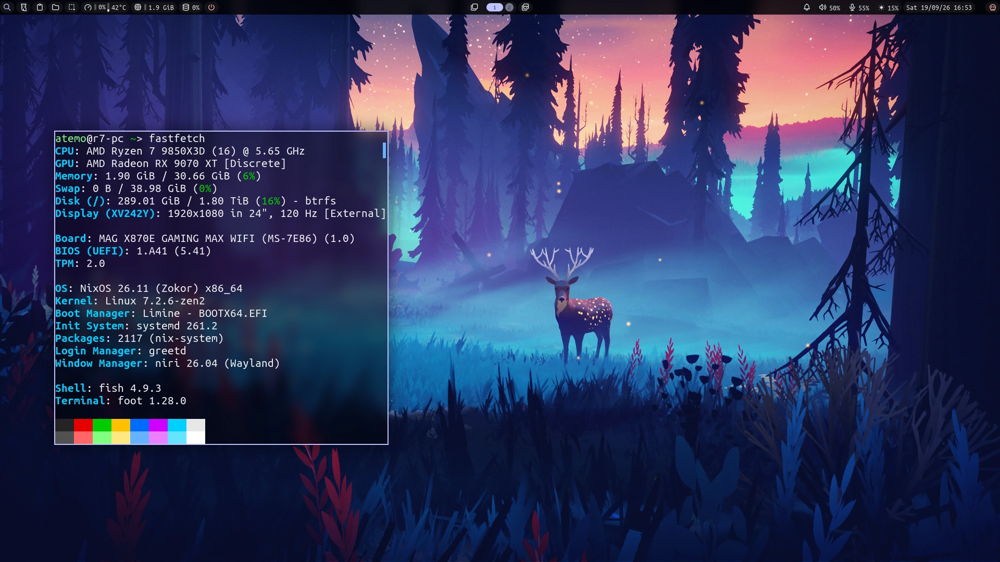

Wallpaper by Mikael Gustafsson.

---

<details>
<summary><h3>Monthly changelog (DD/MM/YYYY)</h3></summary>

### 22/09/2026
- Tweaked/corrected wording in the README.

### 21/09/2026
- The README has been overhauled.
- Fixed spacing in two computers' `gpu.nix` modules.
- Completed the `libvirt` computer's modules.
- Moved the `nvidia.nix` module from `/etc/nixos/extra-modules/config/nvidia.nix` to `/etc/nixos/system/nvidia.nix`.
- LACT is now conditionally activated for R7-PC only if the `activeGpu` option is set to `amd`.

### 19/09/2026
- `micro`'s files are included more selectively than before.
- Updated comments in various places.
- The custom `config.user.name` option now checks for valid characters and length.
- The computers/hosts are now automatically selected by their `networking.hostName` option when rebuilding the system with the `nix-update-*`, `nix-upgrade-*`, and other relevant FISH shell abbreviations when run with the normal user.

### 17/09/2026
- Overhauled the MiDiPLUS SmartPAD macro pad script.
- Updated miscellaneous Noctalia settings.

### 12/09/2026
- Right-clicking on the power button in the bar now shows the power profile switching widget.

### 10/09/2026
- Overhauled the power actions in Noctalia.

### 09/09/2026
- Power actions are no longer visible by default without a prefix in the program launcher.
- Added `corefonts` and `vista-fonts` for additional compatibility when reading and editing documents from Windows computers.

### 05/09/2026
- Transitioned from Noctalia Shell 4.X to Noctalia 5.X.
- Fixed duplicate `pkgs.lib.getBin` in `./programs/system-info.nix`.
- `btop` has higher privileges and better access to more hardware sensors.
- Switched from GDM to the Noctalia Greeter.
- Theming now has its own `config` module to more easily share theming configurations across modules.
- The Zen kernel is now the default kernel in use, with the commented option to use the latest kernel still there.
</details>

---

<h1 align="center">Atemo's NixOS configuration</h1>
<p align="center"></p>
<h4 align="center">An opinionated NixOS configuration that does not piss me off</h4>

---

# Introduction
## What is this?
This is **my personal NixOS configuration**. It is the one I use on my personal computers, and it is **not** meant to simply be used by everyone else. I share it for everyone to take inspiration from, but I cannot guarantee or support such an installation on your own computers.

It is also a successor of my old NixOS configuration, which has long been archived and is here for historical purposes. It makes for a great comparison of how things evolved. If you enjoy reading terrible Nix code, and bash your head against a wall at silly beginner mistakes, you may feel free to go look and cringe at it. \
https://github.com/Atemo-C/OLD-NixOS-Configuration

## NixOS components
This configuration is made to be run with the `nixos-unstable-small` channel. As such, it is not viable for use on weaker hardware, where compilation times may be too great. This can be alleviated by building the NixOS configuration from another computer, but you may also be able to replace most of the software with Flatpaks or the likes, if you want.

Flakes, Home Manager, Flatpaks, AppImages, and the likes are not used in this configuration. I have nothing against them:
- Flakes make the system a lot more cleanly reproducible, and many projects now only include a Flake as the way to use them
- Home Manager can declaratively manage your dotfiles in a Nix way that is very satisfying and convenient
- Flatpaks always have your back when (not "if") Nix packages fall apart
- AppImages are, uh, a thing that works?
Etc…

But, I find the idea of a more 'pure' (whatever that may mean) NixOS configuration rather attractive, if saying such a thing makes sense. I have my own ways of handling things that are otherwise handled there, but, so far, it has not caused me many headaches. You may not find many other configurations like this online, most will at least use Flakes or Home Manager, so be careful if you want to take inspiration from it.

## Desktop components
### Boot loader
The bootloader is Limine. It is the nicest bootloader I have come across on the Linux world, short of letting the EFI handle booting on its own. With it comes Plymouth, for a nicer graphical boot screen. \
https://limine-bootloader.org/

### Display manager
The display manager is the Noctalia Greeter. It integrates very well with Noctalia, the desktop shell, and is thus a natural choice. \
https://github.com/noctalia-dev/noctalia-greeter

### Wayland compositor
The Wayland compositor is Niri. Lightweight, snappy, easy, scrollable-tilling, it just has everything I want and some more. With it, I also use the Oniri program, which automatically maximizes a window when it is the only one present. \
https://github.com/niri-wm/niri
https://github.com/Antiz96/oniri

### Desktop shell
The desktop shell is Noctalia. Do you need a bar, a notification daemon, a graphical polkit agent, launcher, clipboard manager, wallpaper utility, and basically everything under the sun for under 200mb of RAM usage? Noctalia is here for that. \
https://noctalia.dev/

## Configuration structure
Most things are obvious by name alone, but it cannot hurt to give a short description to each major directory of this configuration.

### `configuration.nix`
Really, this should be named something like `index.nix`, but I have decided to keep it named that way for now. What it does is import everything that is not computer-specific, such as most of the programs I use, shared system configuration, and more. \
It is then imported into each computer's `settings.nix` module, meaning that each computer is the head of the entire NixOS configuration, rather than `configuration.nix` filling that role.

### `computers/`
This directory holds the profiles for the computers I use. Be it my main desktop, random laptops or virtual machines, they will end up here. Most other NixOS configurations call the `hosts` instead, which is entirely if not more valid, but I prefer using `computers`.

### `desktop/`
This directory holds everything that configures the graphical desktop experience together. It configures the Niri Wayland compositor, Noctalia Greeter and desktop shell, as well as their respective configuration files.

### `extra-modules/`
When standard NixOS modules are not enough, I add my own. Most are very simple ones, such as the `username.nix` module that allows me to set the username and title once in `users/settings.nix` and for them to be usable everywhere with `${config.user.name}` and `${config.user.title}`. Some others are creations that are frankly a little absurd, such as the `midiplus-smartpad-macropad` NixOS module/DASH script fusion, transforming my MiDiPLUS SmartPAD into a macropad.

### `input/`
Most input-related modules ends up here, either used globally or imported in your computer's `settings.nix` module.

### `programs/`
Programs I want to install and sometimes configure on my system. This alongside the `desktop/` directory already gives a very complete desktop experience for me.

### `storage/`
Every file management and storage-related modules and settings. It used to hold more modules before they were moved to the specific computer directories they now belong to, but it is important enough for me to keep the directory here rather than merge it into something like the `system/` directory. Speaking of…

### `system/`
Audio, bluetooth, booting, language, networking, everything that (to me) screams "system component" ends up here. I can understand how something like `ssh.nix` can be considered questionable as a "system" component, but to me, it just feels that way, so it is here.

### `theming/`
The mess that is Linux desktop theming goes here. I hate touching this. Theming is so much more fragile than it used to be…

### `user/`
The user's settings and shell settings live here. If you fancy, you could reasonably put things like your user's profile picture or wallpapers there as well, but I prefer keeping this in my `$HOME` directory.

### `virtualisation/`
I debated putting the modules in the `programs/` directory instead, but opted against it, for the simple reason that this not only contains host virtualisation tools, but guest additions as well. It just makes sense to have it be separate.

# Use cases, hardware requirements, etc
## Targeted use-case
- Single-user system
- Personal computing and everything that goes along with it
- x86_64 support
- This entire configuration is for **me**; It may not work well for you

## Hardware requirements
### Minimal
Anything with over 1 GB of RAM and a few GB of storage. You **will** suffer, your system **will** constantly crash trying to build the system, you **will** want to initiate an immediate and painful defenestration of yourself, your loved ones, and your computer; But at this point, it is on you. Though, I wish this software could be light enough where this would not be a problem…

### Recommended
Anything with over 8 GB of RAM, over 100 GB of decently snappy solid-state storage, and a somewhat modern Vulkan-capable GPU with actively maintained drivers.

### My own hardware
My main workstation has this hardware:
| Components  | Details                       |
|-------------|-------------------------------|
| CPU         | AMD Ryzen 7 9850X3D           |
| GPU         | AMD RX 9070 XT                |
| RAM         | 2×16 GB @6000MHz              |
| Storage     | 2 TB NVMe SSD<br> Random HDDs |
| Motherboard | MSI X870E GAMING MAX WIFI     |

## Features not yet implemented or thoroughly tested
Including but not limited to:
- Accessibility features (I have no one with accessibility problems to tweaks things with)
- Touchscreen support (I have no touchscreen-capable device)
- Remote desktop (I mean, you *could* probably-maybe use Steam?)
- NVIDIA GPUs (I no longer have an NVIDIA GPU, the existing NVIDIA configuration is 'old' and best-effort)

---

> [!Warning]
> I must remind you that this installation is purely what I use, and you would most likely be better off taking inspiration from this configuration rather than just clone and use it.
>
> The following installations instructions are what I want most of my systems to be configured like. They are more of a reminder for me than a guide for you.
>
> To stay as reasonably dependency-free and universal as possible, all installation steps will use standard utilities through the command-line. You may adapt them to whichever tool fits your installation workflow best.

<details>
<summary><h1>Installation</h1></summary>

## Assumptions
It is assumed, for these installations instructions, that you:
- Are familiar with Linux and NixOS, or have at least used the latter once
- Are comfortable working in the command-line
- Are currently already running a Linux distribution of some kind
- Have a stable power source and networking
- Have configured your computer's firmware to boot and install NixOS properly
- Have read and acknowledge everything this README has to offer
- Have read over and personalized the installation instructions below **before** proceeding with the installation.

## Creating a bootable NixOS medium.

### Acquiring NixOS
Since this configuration is based on the `nixos-unstable-small` channel, it is highly recommended to download the latest `nixos-unstable` ISO image.
- [Graphical ISO](https://channels.nixos.org/nixos-unstable/latest-nixos-graphical-x86_64-linux.iso)
- [Graphical ISO's SHA-256](https://channels.nixos.org/nixos-unstable/latest-nixos-graphical-x86_64-linux.iso.sha256)
- [Minimal ISO](https://channels.nixos.org/nixos-unstable/latest-nixos-minimal-x86_64-linux.iso)
- [Minimal ISO's SHA-256](https://channels.nixos.org/nixos-unstable/latest-nixos-minimal-x86_64-linux.iso.sha256)
Always verify your ISOs with the provided 256-bit hash.

I use my own ISO which uses the `nixos-unstable-small` channel directly instead of `nixos-unstable`, but if you are using one of the ISOs above, you can change that channel when installing NixOS later on. I may post more information on said ISO once I have a polished experience with it.

### Writing the ISO
The NixOS ISO is too big to fit on a CD or smaller. As such, a DVD or any removable and bootable storage device with above 4 GB of storage is necessary. For this installation's instructions, I will be using a USB flash drive. \
**All data on this device will be erased!**

1. Plug the USB flash drive into your current Linux computer.
2. Run the `lsblk` command to identify your the desired drive to write the ISO onto.
```
NAME                    MAJ:MIN RM   SIZE RO TYPE  MOUNTPOINTS
sda                       8:112  1  28,7G  0 disk
└─sda1                    8:113  1  28,7G  0 part
nvme0n1                 259:0    0 931,5G  0 disk
…
```
Here, `sda` is the flash drive I want.
3. Write the ISO file to the desired drive with the following command as a superuser:
```shell
dd bs=4M conv=fsync oflag=direct status=progress if=latest-nixos-graphical-x86_64-linux.iso of=/dev/sda
```
- Replace `latest-nixos-graphical-x86_64-linux.iso` with the appropriate file name
- Replace `sda` with the appropriate device
4. Once done, unplug the flash drive from this computer, and plug it in the computer you want to install NixOS onto. If it is the same computer, leave it plugged in.

## Pre-installation
### Booting
1. If not already done, insert the newly created installation media into your computer, and start it. If your computer does not automatically boot to it, refer to your BIOS' settings and your motherboard or laptop manufacturer's documentation on how to access it or the boot device list.

2. Once booted, the first thing you want to ensure is that your keyboard layout is the correct one. If you have booted with a graphical ISO, go to the graphical settings to configure it. If you have booted in a TTY, you can use the `loadkeys` command to select the desired keyboard layout, e.g. with `loadkey us-intl` or `loadkeys fr-latin9`.

3. The only remaining thing to do is to have a stable network. In a graphical ISO, you can go into the settings to configure your WiFi. In a TTY, you can use the `nmtui` utility to connect to a WiFi network. You can also share your phone's network via USB, though it is most reliable on Android devices. If you have Ethernet, you should generally not have to worry about any of that, for it should be configured automatically.

### Partitioning
Before we actually start with partitioning, here is how I usually set up my system's partitions:
- 1 GB EFI partition (for booting and storing NixOS generations)
- XGB Swap (usually the size of my RAM, a little less if I have a lot of RAM)
- The rest is all Btrfs storage on the root partition
- Both the swap and root partitions are encrypted with LUKS2
- The root volume has the following subvolumes:
	- @ (root), with zstd compression
	- @home, with zstd compression
	- @nix, with zstd compression and no access time updates (noatime).

If you have different needs or desires, or use a legacy BIOS-only system, you will need to adapt the following steps to your own needs, which is the case for basically everything in this installation self-guide.

1. Enter a shell as root with `sudo -i`. **All** actions, for this and all other instructions, are to be done within this root environment.
2. Run the `lsblk` command to identify the storage drive you want to install NixOS onto:
```
NAME                    MAJ:MIN RM   SIZE RO TYPE  MOUNTPOINTS
sda                       8:112  1  28,7G  0 disk
└─sda1                    8:113  1  28,7G  0 part
nvme0n1                 259:0    0 931,5G  0 disk
…
```
Here, `nvme0n1` is the NVMe SSD I want to install NixOS onto, replace it with your own. \
**All data on this device will be erased!**
3. Format the drive to GPT:
```shell
parted /dev/nvme0n1 mklabel gpt
```
4. Create the boot partition:
```shell
parted /dev/nvme0n1 mkpart ESP fat32 1mb 1gb
```
5. Set the `boot` flag `on` for the boot partition:
```shell
parted /dev/nvme0n1 set 1 esp on
```
6. Create the swap partition, the size of your liking (here, an 8 GB swap):
```shell
parted /dev/nvme0n1 mkpart swap linux-swap 1gb 9gb
```
7. Create the root partition, taking the rest of the disk:
```shell
parted /dev/nvme0n1 mkpart root btrfs 9gb 100%
```

### LUKS encryption
I use LUKS disk encryption for the swap and root partitions. Note that you may need more than 1 GB of RAM at boot to ensure proper decryption; At least, this is my experience.
1. Run the `lsblk` command to identify the newly partitioned drive:
```
NAME                    MAJ:MIN RM   SIZE RO TYPE  MOUNTPOINTS
sda                       8:112  1  28,7G  0 disk
└─sda1                    8:113  1  28,7G  0 part
nvme0n1       259:0    0 931,5G  0 disk
├─nvme0n1p1   259:1    0     1G  0 part
├─nvme0n1p2   259:2    0     8G  0 part
└─nvme0n1p3   259:3    0 922,5G  0 part
```

2. Set up LUKS encryption for the swap partition:
```shell
cryptsetup --verify-passphrase luksFormat --label swap /dev/nvme0n1p2
```
3. Set up LUKS encryption for the root partition:
```shell
cryptsetup --verify-passphrase luksFormat --label root /dev/nvme0n1p3
```
4. (Optional) Create backup headers and store them in a safe, preferably itself encrypted storage device. This is useful in case they ever get corrupted.
```shell
cryptsetup luksHeaderBackup /dev/nvme0n1p2 -header-backup-file luks-header-backup-swap.bin
cryptsetup luksHeaderBackup /dev/nvme0n1p3 -header-backup-file luks-header-backup-root.bin
```
5. Open the encrypted partitions.
If you use an SSD, use the `--allow-discards` option after `cryptsetup open`. If you install on an HDD, do not.
```shell
cryptsetup open --allow-discards /dev/nvme0n1p2 swap
cryptsetup open --allow-discards /dev/nvme0n1p3 root
```

### Formatting
1. Format the boot partition:
```shell
mkfs.fat -F 32 -n BOOT /dev/nvme0n1p1
```
2. Format the swap volume:
```shell
mkswap -L Swap /dev/mapper/swap
```
3. Format the storage volume:
```shell
mkfs.btrfs -L Storage /dev/mapper/root
```

### Mounting
1. Turn the swap on:
```shell
swapon /dev/mapper/swap
```
2. Mount the root volume:
```shell
mount -v -t btrfs /dev/mapper/root /mnt
```
3. Create the Btrfs subvolumes.
Here, they are `@` (root), `@home`, and `@nix`.
```shell
btrfs subvolume create /mnt/@
btrfs subvolume create /mnt/@home
btrfs subvolume create /mnt/@nix
```
4. Unmount the root volume.
```shell
umount -v /mnt
```
5. Remount the root volume, but now with the proper Btrfs subvolume.
Additionally, I enable ZSTD compression.
```shell
mount -v -o subvol=@,compress=zstd:3 /dev/mapper/root /mnt
```
6. Create the mount points for the `boot`, `home`, and `nix` subvolumes.
```shell
mkdir -v /mnt/boot
mkdir -v /mnt/home
mkdir -v /mnt/nix
```
7. Mount the `home` and `nix` subvolumes.
Additionally, I enable ZSTD compression for both and enable `noatime` for `@nix`.
```shell
mount -v -o subvol=@home,compress=zstd:3 /dev/mapper/root /mnt/home
mount -v -o subvol=@nix,compress=zstd:3,noatime /dev/mapper/root /mnt/nix
```
8. Mount the boot partition:
```shell
mount -v -o umask=077 /dev/nvme0n1p1 /mnt/boot
```

## NixOS configuration
### Generating and cloning
1. Generate the default NixOS configuration and automatically-generated hardware configuration file:
```shell
nixos-generate-config --root /mnt
```
2. Copy the hardware configuration file away:
```shell
rsync -ah --progress /mnt/etc/nixos/hardware-configuration.nix ~/
```
3. Remove all files in the `/mnt/etc/nixos/` directory, since they will not be used:
```shell
rm -v /mnt/etc/nixos/*
```
4. Clone this repository to `/mnt/etc/nixos/`:
```shell
git clone https://github.com/Atemo-C/NixOS-configuration /mnt/etc/nixos
```
5. Choose a name for your computer, all in lowercase and with no special characters. This will be the named used by your computer on the network, and also the name of the directory its own modules will reside in. \
For this guide, I will call it `testing-pc`.
6. Create the directory `/mnt/etc/nixos/computers/testing-pc`, replacing `testing-pc` by the desired name:
```shell
mkdir -v /mnt/etc/nixos/computers/testing-pc
```
7. Copy the previously moved hardware configuration file to your computer's directory:
```shell
rsync -ah --progress ~/hardware-configuration.nix /mnt/etc/nixos/computers/testing-pc/
```

### `storage.nix` module
1. Get the UUID of your swap partition.
We will write it to `/mnt/etc/nixos/computers/testing-pc/storage.nix`; It will be at the bottom of the module, ready to be used when we configure storage later.
```shell
blkid /dev/nvme0n1p2 >> /mnt/etc/nixos/computers/testing-pc/storage.nix
```
2. Open this module with your preferred text editor.
In this live environment, you can install the text editor of your choice with `nix-env -iA nixos.your-text-editor-here`.
```shell
<editor> /mnt/etc/nixos/computers/testing-pc/storage.nix
```
3. Keep the UUID.
You will now see the single line containing the Swap partition's information.
```nix
/dev/nvme0n1p2: UUID="00000000-0000-0000-0000000000" LABEL="swap" TYPE="crypto_LUKS" PARTLABEL="swap" PARTUUID="11111111-1111-1111-1111-111111111111"
```
What we care about here is the UUID.
```nix
UUID="00000000-0000-0000-000000000000"
```
4. Configure the storage.
In this module, write the following:
```nix
{ ... }: {
	boot.initrd.luks.devices = {
		"swap" = {
			device = "/dev/disk/by-uuid/00000000-0000-0000-000000000000";
			allowDiscards = true;
		};
		"root".allowDiscards = true;
	};

	fileSystems = {
		"/".options = [ "compress=zstd:3" ];
		"/home".options = [ "compress=zstd:3" ];
		"/nix".options = [ "compress=zstd:3" "noatime" ];
	};
}
```
In it, modify the following:
- Replace the UUID by the one you have just kept
- If on an HDD, remove `allowDiscards = true;`
- If you use different filesystem options, edit them appropriately
- Add comments if you want.

I usually also add a physical encryption USB flash drive to automatically unlock them when it is safe to do so, with password fallback after 10 seconds, but this is optional. Still, in the following segment is the result of how I do it:
```nix
{ ... }: {
	# Additional device encryption settings.
	#
	# Here is how to create a dedicated USB flash drive for
	# unlocking your LUKS-encrypted system (secure it away!):
	# 1. Generate a random key with `dd`, lqke so:
	#    • dd if=/dev/random of=disk-key.key bs=4096 count=1
	#
	# 2. Add the key to your encrypted storage partition(s) that use the same password:
	#    • run0 cryptsetup luksAddKey /dev/your-encrypted-partition-here ./disk-key.key
	#    (Repeat this step if you have multiple encrypted partitions.)
	#
	# 3. Write the key file to the USB flash drive.
	#    ALL data on it will be erased. Use a tiny, throwaway USB flash drive.
	#    • run0 dd if=disk-key.key of=/dev/your-usb-flash-drive-here
	boot.initrd.luks.devices = {
		"swap" = {
			# Add the swap LUKS device, as `nixos-generate-config` does not.
			device = "/dev/disk/by-uuid/8ede86b8-0b1d-4d60-82a-facf8a3ed6c4";

			# If on an SSD with discard support, enable it.
			allowDiscards = true;

			# Hardware key encrpytion keys, with manual password fallback.
			keyFileSize = 4096;
			keyFile = "/dev/disk/by-id/usb-Generic_Flash_Disk_94A5D05A-0:0";
			keyFileTimeout = 10;
		};

		"root" = {
			# If on an SSD with discard support, enable it.
			allowDiscards = true;

			# Hardware key encryption keys, with manual password fallback.
			keyFileSize = 4096;
			keyFile = "/dev/disk/by-id/usb-Generic_Flash_Disk_94A5D05A-0:0";
			keyFileTimeout = 10;
		};
	};

	fileSystems = {
		# ZSTD compression for the root (@) subvolume.
		"/".options = [ "compress=zstd:3" ];

		# ZSTD compression for the @home subvolume.
		"/home".options = [ "compress=zstd:3" ];

		# ZSTD compression + no-access-time for the @nix subvolume.
		"/nix".options = [ "compress=zstd:3" "noatime" ];
	};
}
```
5. Save the file and exit it.

### `gpu.nix` module
1. Create the `/mnt/etc/nixos/computers/testing-pc/gpu.nix` module and open it with your text editor.
```shell
<editor> /mnt/etc/nixos/computers/testing-pc/gpu.nix
```
2. In this file, define what GPU you are using with the `hardware.activeGpu` option. It can be one of `default` (Intel/AMD/etc), `amd` (for ROCM support and more on modern AMD GPUs), or `nvidia-proprietary` (for NVIDIA GPUs, from the 1630 and above). You may additionally want to set additional GPU options if you want, like support for overclocking, or other GPU-related tools. \
Note that for these NVIDIA GPUs, you will need to import the `nvidia.nix` module as well.
Here, it will simply be `default`:
```nix
# Which of the major GPU brands is used.
# This is used to guide which variant of packages should be installed.
# Can be one of `default` (intel & co), `amd`, or `nvidia-proprietary`.
{ ... }: { hardware.activeGpu = "default"; }
```
But if you have an NVIDIA GPU that fits the previous criteria, it would be:
```nix
{ ... }: {
	# Which of the major GPU brands is used.
	# This is used to guide which variant of packages should be installed.
	# Can be one of `default` (intel & co), `amd`, or `nvidia-proprietary`.
	hardware.activeGpu = "default";

	# Import the proprietary NVIDIA GPU drivers (1630 and above only).
	imports = [ ../../system/nvidia.nix ];
}
```
3. Save the file and exit it.

### `input.nix` module
1. Create the `/mnt/etc/nixos/computers/testing-pc/gpu.nix` module and open it with your text editor.
```shell
<editor> /mnt/etc/nixos/computers/testing-pc/input.nix
```
2. In this file, you can set your keyboard layout configuration with `services.xserver.xkb = {};`; These settings will be applied to other environments (TTY/Wayland/etc) as well. \
Here, I will be using a US international layout (with dead keys) as a main layout, with a normal French layout as a secondary.
```shell
# Keyboard layout configuration on this system.
# To see a complete list of layouts, variants, and other settings:
# • https://gist.github.com/jatcwang/ae3b7019f219b8cdc6798329108c9aee
#
# To see why this list cannot easily be seen within NixOS:
# • https://github.com/NixOS/nixpkgs/issues/254523
# • https://github.com/NixOS/nixpkgs/issues/286283
{ ... }: { services.xserver.xkb = {
	layout = "us,fr";
	variant = "intl,";
}; }
```
3. Save the file and exit it.

### The main `settings.nix` module
This is the file where other miscellaneous settings are set, and where the previously-written modules are imported into. It also imports the main `configuration.nix` module, which itself imports the rest of the system.

1. Create the `/mnt/etc/nixos/computers/testing-pc/settings`.nix module and open it with your text editor.
```shell
<editor> /mnt/etc/nixos/computers/testing-pc/settings.nix
```
2. In this file:
	- Import the previously created `input.nix` and `gpu.nix` modules
	- Import the automatically-generated `hardware-configuration.nix` module
	- Import the main `configuration.nix`
	- Let the EFI boot variable be editable by the bootloader
	- Set your computer's hostname as previously mentioned
	- Add any other computer-specific configuration or module imports you may wish to have.
Note that you can see optional imports at the bottom of the `configuration.nix` module, which you can import there as well. Here is the result for in my case:
```nix
{ ... }: {
	imports = [
		# The main system configuration.
		# Not importing it results in, well, no system.
		../../configuration.nix

		# The automatically-generated hardware configuration file.
		# Not importing it results in, again, no system.
		./hardware-configuration.nix

		# Input devices and keyboard layout.
		./input.nix

		# GPU configuration and utilities.
		./gpu.nix
	];

	# Whether the installation process is allowed to modify EFI boot variables.
	# Once installed and working, if after an update, it fails to "install" again,
	# it should be safe to turn this option off, even if it is not ideal.
	# We love firmware bugs.
	boot.loader.efi.canTouchEfiVariables = true;

	# Name of the computer over the network.
	# For this NixOS configuration, it must be lower-case.
	networking.hostName = "testing-pc";
}
```

### User name and title
1. Open the `/mnt/etc/nixos/user/settings.nix` module with your text editor.
```shell
<editor> /mnt/etc/nixos/user/settings.nix
```
2. Change the default username and title (here, `atemo` and `Atemo Cajaku` respectively) to your own. You may also wish to edit which additional groups your user is added to, change your user's `$HOME` directory, or whatever user-specific changes you want.
3. Save the file and exit it.

## Installation
1. Verify your changes. Verify everything. Read over everything added, changed, or deleted at least twice. Re-read this entire thing if you need to.
2. Check the basic syntax of all modules with the following commands:
```shell
find /mnt/etc/nixos -type f -name '*.nix' -exec nix-instantiate --parse-only {} +
```
Fix any syntax errors if they exist.
3. Ensure your network is still connected and working, and that your computer has a stable power source.
4. Change the NixOS channel to `nixos-unstable-small` and update it:
```shell
nix-channel --add https://channels.nixos.org/nixos-unstable-small nixos
nix-channel --update
```
5. Install the system with the following command, replacing `testing-pc` with the computer name you have previously chosen. If you have low RAM, use an HDD, or have a slow CPU, this installation will take a while. Since we are using the `nixos-unstable-small` channel, expect it to take longer than a standard NixOS installation due to the high likelyhood of your system having to compile certain packages from source.
```shell
nixos-install -I nixos-config=/mnt/etc/nixos/computers/testing-pc/settings.nix
```
If it fails to build due to errors in the configuration, fix them, and try again. If the installation fails due to a package that fails to build, you may comment said package out until it is fixed in nixpkgs and try again.
6. Once NixOS is installed, set your user's password, replacing `your-user-here` with the username you previously set.
```shell
nixos-enter --root /mnt --command 'passwd your-user-here'
```
7. You can now safely power off the system, remove the drive used for installating NixOS, and boot into the full NixOS installation.

## Post-installation notes
- You will need to bring your own user's files (or start fresh), and might need to set some settings in some parts of the system (e.g. Noctalia's wallpaper settings, etc). I have my own on a backup, which allows me to easily transfer over everything and have the same system on every computer I own.
- When updating/upgrading/etc nixos, you will not have to manually type the full path to your device's configuration. Instead, if your default user shell stays FISH, you can simply use the provided shell abbreviations like `nix-update-now`, `nix-upgrade-boot` etc, and it will automatically point to the correct file on the computer, assuming your computer's name (hostname), directory its `settings.nix` module resides in, are all named the same and located in the correct place.
- You may be very confused about some things within the desktop, this is almost to be expected, since you would be using **my** configuration tailored specifically towards **my** needs and desires. Again, this whole guide is more for me to remember and for you to take inspiration from, rather than a copy-paste commands 'guide'.
- You can report any bugs and suggest features you may want, but I will most likely not offer support otherwise.
- If you have a metered network connection, this is not for you. If you have a weak computer, this is not for you. If you are not me, this is probably not for you either.
- Enjoy!

</details>

# Some helpful NixOS resources
Help is available in:
- The configuration.nix(5) man page
- The on-device manual by running `nixos-help`
- The online manual at https://nixos.org/manual/nixos/unstable/index.html
- The NixOS Wiki at https://wiki.nixos.org
- The Nix.dev documentation for the nix ecosystem at https://nix.dev

A searchable list of available packages can be found here: \
https://search.nixos.org/packages?channel=unstable

A searchable list of available options can be found here: \
https://search.nixos.org/options?channel=unstable

Niri's documentation can be found here: \
https://niri-wm.github.io/niri/index.html

Noctalia's documentation can be found here: \
https://docs.noctalia.dev/noctalia/

Noctalia Greeter's documentation can be found here: \
https://docs.noctalia.dev/greeter/