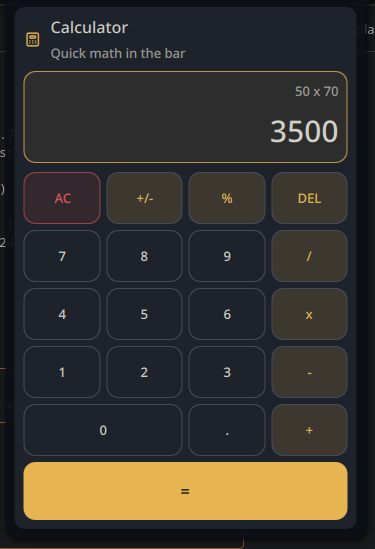

# noctalia-calculator

A theme-aware calculator plugin for Noctalia on Niri, with a bar widget, floating panel, keyboard support, and a clean UI that follows the active shell colors.

## Preview

## Features

- Full expression evaluation with operator precedence via bundled `AdvancedMath.js`
- Bar widget with optional live result badge
- Floating panel with 21-button grid
- Mouse and keyboard input
- Theme-aware colors and spacing
- 10-language i18n (en, pt, es, fr, de, it, ru, zh, ja, ko)
- Configurable decimal precision (0-10)

## Usage

- Left click the bar widget to open the calculator
- Right click the bar widget for the context menu
- Keyboard:
  - `0-9` for digits
  - `+ - * /` for operators
  - `.` or `,` for decimal input
  - `Enter` for equals
  - `Backspace` for delete
  - `Esc` or `Delete` for clear
  - `F9` for sign toggle
  - `%` for percent

## Files

- `AdvancedMath.js`: math evaluation library (from noctalia-shell Helpers)
- `Main.qml`: calculator logic
- `BarWidget.qml`: bar widget entry point
- `Panel.qml`: floating calculator panel
- `Settings.qml`: plugin settings UI
- `i18n/`: translations (en, pt, es, fr, de, it, ru, zh, ja, ko)

## Copying the result

When the panel is open and a value is showing, a small copy icon appears to the right of the result. Click it to copy the value to the system clipboard. A toast confirms the copy.

Requires `wl-copy` (from `wl-clipboard`) on `PATH`. The icon is hidden in the resting `0` state and while an error is displayed.

## Author

Pir0c0pter0
`pir0c0pter0000@gmail.com`
